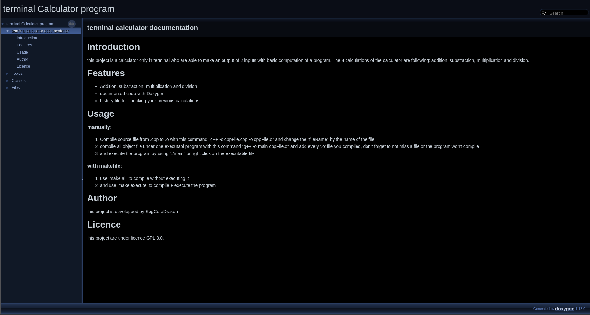

# **TERMINAL CALCULATOR**

- - -
# **SOMMARY**

- [introduction](#introduction)
  - [why does this project exist?](#why-did-made-this-project)

- [small explanation about the program](#small-explanation-of-what-the-project-does)
  - [files](#files)

- [how to compile the program](#how-to-compile-the-program)
  - [using make](#using-make)
  - [manually](#manually-compilation)
  
- [how to contribute](#how-to-contribute)
  - [git commit](#git-commit-message)
  - [submit issues or ideas](#submitting-issues-or-ideas)
    - [issues](#for-issues)
    - [ideas](#for-ideas)

- [conventions](#conventions)
  
- [roadmap](#roadmap)

- [conclusion](#conclusion)

- [contributors](#contributor)

- - -
# **INTRODUCTION**

This program is a calculator that can perform basic computer calculations. These operations 
include: addition, subtraction, multiplication, and division in a terminal-only interface.

## **Why did made this project?**

I made this project mainly to learn and practice, but it was also created to help me learn more 
about how a project is structured and the best conventions for open-source software for later. 
Since I started coding, I’ve really wanted to create open-source software and contribute to other 
software as well.

## **Licence**

The entire project is licensed under the GPL 3.0 or later license. This means you are allowed to 
share, modify, and distribute the project without limitation, except for the GPL 3.0 restrictions, 
such as if the project is released in a binary version, you must release the source code under the 
same license (GPL 3.0 or a later version).

- - -
# **Small explanation of what the project does**

**the project is divided into 3 systems**

- system 1: Calculations and output
- system 2: History and save system
- system 3: Small ASCII UI for aesthetics

These 3 systems are connected by inclusion, like `#include` and they are partially independant, 
that. This means system 1 can be fully
independant, but you need to remove all functions in the include files to fully separate it

## **Files**

The projects has 4 source files and 3 header files, here is a little example of
the source files in a table:

|Source files   |Desc |
|---------------|-----|
|calculator.cpp | Does all the computations |
|save_system.cpp | Save the computations, type and  result in a file |
|terminal_ui.cpp | Simple full ASCII interface for the calculator |
|main.cpp |The base of the calculator, where the program will be executed |

All headers are pretty much the same, just declaring all functions, classes, and other components 
without the logic, because we add the logic in the source files.

There are also other files in `logs/` folder but they are only for history and are not useful 
except for `check logs` option.

- - -

# How to compile the program?

to compile the program, you have 2 options

- **using cmake:** Faster already automated and compiles everything
- **manually:** Slower but lets you learn more about how compiler work for compiled language

## Using cmake:

### **INSTALLATION**

To use cmake, make sure you have it installed. If not, use the command adapted to your 
package manager

| Distros      | Commands |
|--------------|----------|
| Arch-based   |`pacman -S cmake` |
| Debian-based |`apt install cmake` |
| Fedora-based |`dnf cmake` |

### **COMPILATION**

Run `cmake -GNinja -S. -Bbuild` in any terminal you want, make sure you installed make before running the command. `-B` is for the build folder, `-S` for the source (`.` mean source is where the CMakeLists.txt is) and `-G` for the build generator (the project has already Ninja as build generator but type it too to be sure that Ninja is really used for the build generator).

The project have 3 other optional parameters:

`-DSET_DEBUG=ON,OFF` Is for the debug option when the project is compiled.

`-DSET_OPTI=1,2,3` Is for the optimization with GCC or CLANG, number can only be `1`, `2`, or `3`.

`-USE_CLANG=ON,OFF` Is for using clang instead of gcc for compiling the project

Then write this command `cmake --build build -- -v` to compile the project, `--build` ask to cmake that we build the project, and the `build` we build inside the build folder. And `-v` it's the verbose parameter, you can remove it if you want.

after compile the project go inside the project and execude the executable in a terminal by writing this `build/terminal_calculator_X_X_X` where X is for the major, minot and patch version.

Normally, makefile are created to compile only the program, but not execute it. To execute the 
program immediately after compilling, type `make execute`
and it will compile + execute the program.

## **Manually compilation**

to manually compile the program, it will take a little longer, but it is similar to using 
makefile, but instead of using make, we do it manually by compiling file by file, here is a step 
by step to compile the program:

**/!\\ BE SURE TO HAVE GCC OR CLANG INSTALLED ON YOUR COMPUTER /!\\**

to install GCC follow the same guide for installing make, but with gcc or clang

 - **step 1:**
   - Compile all the source files into object file like this `g++ -o save_system.o -c 
save_system.cpp` 
   - Be sure to compile `save_system.cpp` and `terminal_ui.cpp` before `calculator.cpp`
 
 - **step 2:**
   - Compile all object files into one executable file like this `g++ -o main main.o calculator.o 
     save_system.o terminal_ui.o`
   - If any error occur, it is probably because you did not compile the project, correctly, or 
there might be errors in
     the project itself. If you think it is a project error please open an issue on the github 
     repo
     
   - **step 3**
     - Once the project is compiled, just type `./main` or the name of the executable you
       made, and the program will start. Follow the instructions in the program for using it.
   
   
  note: to use doxygen doc, simply type `doxygen doxygenConfig` to build the doc, and to use the doxygen doc in your favorite navigator enter in the doc/ folder and enter this commande line `python3 -m http.server 8080` and in your navigator write in the url bar this `http://localhost:8080` and you will normally see this picture 
---

# **How to contribute?**

If you want to contribute to the program, here are some rules and small conventions for making a 
good contribution. Every skill and idea are welcome.

## **Git commit message**

For commiting your modifications, use the following tags for specific types of commits. Include the 
tag in the first message of your commit.

**FIX:** For bug fix (Include the issue number in GitHub).
**FEATURE:** For any new features you add (e.g adding a new option to the calculator or adding a 
new UI system etc.)
**UPGRADE:** For code optimization or change that make the code more readable, etc.
**CHANGE:** For minor change (e.g renaming a variable from "his" to "history"). Be sure to inculde 
the new variable name in the commit message.

## **Submitting issues or ideas**

If you discover a bug or just want to submit an idea, here is what you should include:

### **For issues**:
  - The type of bug (e.g infinite loop, crash, freeze, incorrect output).

  - How to reproduct it.

  - if the bug is difficult to explain, sending some pictures can help you 
and contributor fix the issue.

### **For ideas**

  - The type of idea (e.g adding a new option, adding a new UI style etc)

  - A detailled description of what you want the idea to do and why.

These examples are not strict rules, but they help you to write good issues and ideas to help the 
projet grow.

---
# **Conventions**

For a good project, we need a good conventions. Here are some conventions you need to follow when 
contributing.

  - For clasess, variables and other components, use the **CamelCase** for classes, structs etc., 
and **snake_case** for variables.
 
  - For private member, use the **Hungarian Notation** (add `m_` before the variable name, e.g, 
`my_var` becomes `m_my_var` if it is private; if it is not private, just use `my_var` for naming 
variables).

  - Constants are written in **UPPER_CASE_SNAKE_CASE**.

These conventions **MUST** be followed in the program to keep the program homogeneous and avoid 
using multiple convention, like mixing `m_my_var` and `my_var`, even if both are private.

---
# **Roadmap**

The program has a few roadmaps that I want to complete before makings this project as 
"terminated." Here are the roadmaps:

  - **Make an aesthetic UI for the entire project:** - `[###--]` ~40%

  - **Make the project fully safe for all dangerous calculations (like division by 0)** - 
`[XXXXX]` not implemented yet.

  - **Organize the project** - `[####-]` ~90% Already organized, but if new features are added, 
the progress bar might be frozen.

---
# **Conclusion**

This program is mainly designed to help new coders learn how a basic calculator works, how 
to contribute, and how to submit good issuee or ideas.

It is not a fully structured project with strict commit rules and other conventions. It is just a 
preceful place to practice your commits in a public project. But please avoid broken codes.

---
# **Contributor**

Thanks to every contributor who helps make the project better.

Every commit made by someone will be listed here with some details (like "new contributor" or 
"first commit", maybe both sometime).

### **CONTRIBUTORS:**
 
  namelessChokko (opened an issue for a bug)
